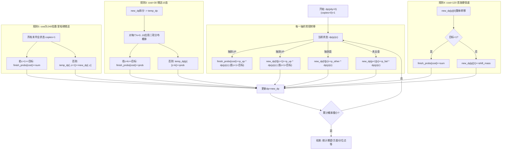

| pity范围 | base(出金率) | p_up | p_other | p_fail |
| --- | --- | --- | --- | --- |
| 0-65 | 0.008 | 0.004 | 0.004 | 0.992 |
| 66-79 | 0.008 + (pity - 65) * 0.05 | base * 0.5 | base * 0.5 | 1 - base |
| 80 | 1.0 | 0.5 | 0.5 | 0.0 |

注：这里的 base 是“出金率”，p_up/p_other/p_fail 分别是抽到UP、抽到歪、没出金的概率。

| 规则 | 触发条件 | 状态变化 | 是否一次性 |
| --- | --- | --- | --- |
| 规则3: 30抽赠送10连 | cost == 30 | 对每个状态追加 10 次独立抽取的二项分布结果，copies += k | 是 |
| 规则4: 120抽首发硬保底 | cost == 120 且 copies == 0 | 若目标=1则直接毕业；否则 copies 从 0 变为 1 | 是 |
| 规则5: 240抽里程碑赠送 | cost % 240 == 0 | 所有未毕业状态 copies += 1 | 否(循环) |